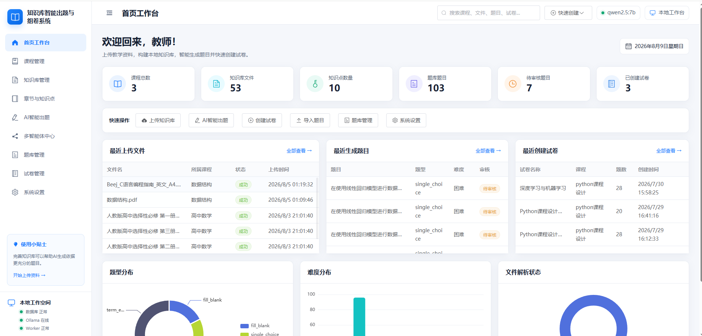
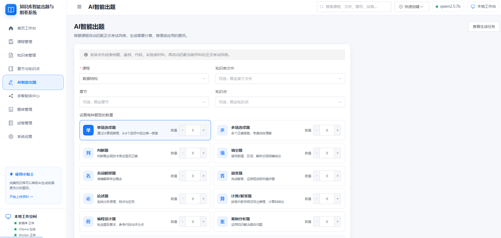
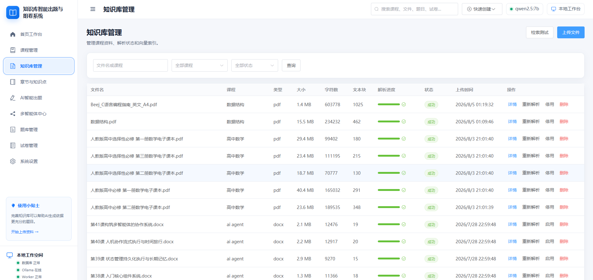
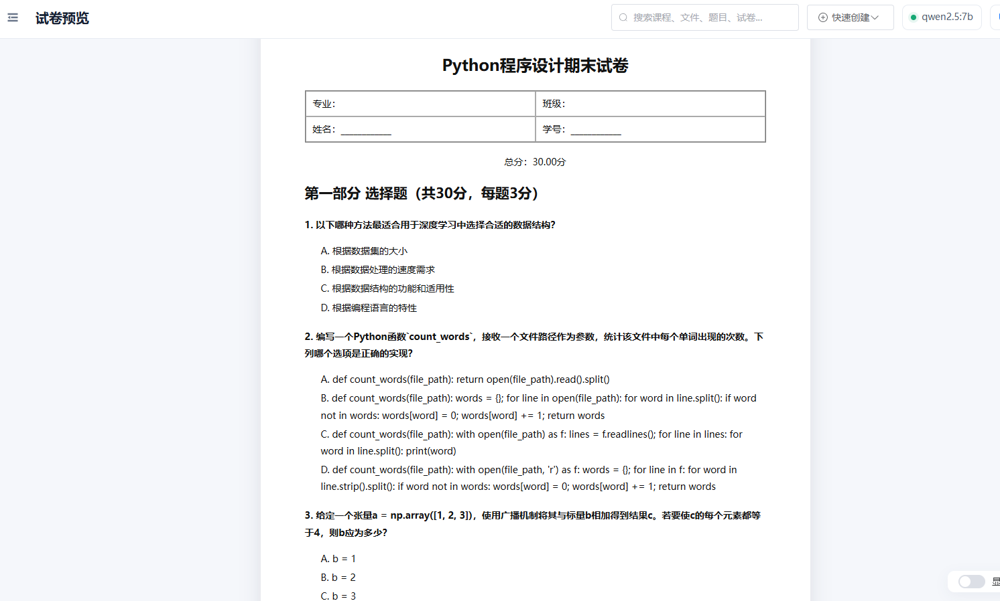

# 基于大模型与 RAG 的知识库智能出题与组卷系统

这是一个本地运行的教学出题系统，支持课程管理、知识库文件解析、RAG 检索、AI 出题、题库审核、智能组卷、试卷预览与导出。系统使用 Ollama 运行本地大模型，数据保存在本机。

## 主要功能

- 课程、章节和知识点管理
- PDF、Word、Markdown 和文本知识库解析
- 向量检索与 RAG 知识库问答
- 按课程、题型和难度生成题目
- 生成任务管理、题目审核与重复检测
- 手动组卷与规则组卷
- 公式渲染、试卷预览、答案解析和文档导出
- 多智能体深度协作

## 安装与启动

- Windows：[README_WIN.md](README_WIN.md)
- macOS：[README_MAC.md](README_MAC.md)

## 项目界面

